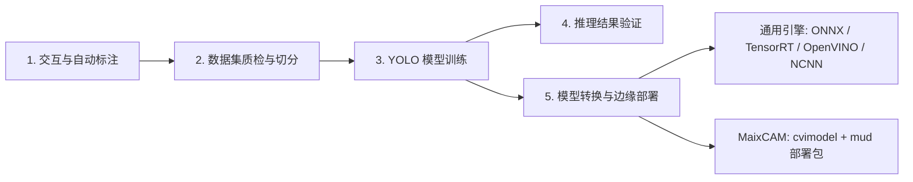
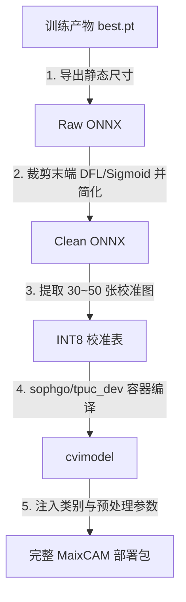

# YOLO Studio

一站式 YOLO 目标检测与分割工作台。集成了**交互式标注**、**SAM 2 辅助分割**、**数据集校验与切分**、**YOLO 本地训练**、**模型推理验证**，以及针对 **MaixCAM（算能 SG2002 / CV181x TPU）** 和常见工业推理引擎的**一键模型导出与量化编译**。

支持 **Linux** 与 **Windows** 双平台，提供 **原生 Python 环境** 与 **Docker 容器化** 两种运行方式。

---

## 为什么选择 YOLO Studio

- **全流程闭环**：标注、质检、切分、训练、验证、端侧量化部署均在同一工具内完成，无需频繁切换脚本与工具链。
- **SAM 2 智能辅助**：内置 YOLO 目标定位与 SAM 2 多边形精细分割，批量生成高质量 Polygon 标注。
- **开箱即用 MaixCAM 边缘部署**：自动裁剪 YOLO 末端后处理节点，调用 TPU-MLIR 编译器完成 INT8/BF16 量化，自动生成 `.cvimodel` 与 `.mud` 统一描述文件及板载测试代码。
- **双端界面与命令行支持**：提供现代化的 PySide6 全功能桌面端、轻量 Tkinter 应急端以及完整的 CLI 自动化子命令。

---

## 快速启动 (Quick Start)

### 🐧 Linux 用户

#### 推荐：Docker 一键运行（免配环境，自动挂载 GPU 与 Docker 编译套接字）
```bash
./run_gui.sh
```
- 启动轻量 Tkinter 界面：`./run_gui.sh tk`
- 进入容器终端：`./run_gui.sh bash`

#### 原生 Python 运行
```bash
# 建议使用 Python 3.10 ~ 3.12
python3 -m venv venv
source venv/bin/activate
pip install -r requirements.txt

# 启动 PySide6 完整界面
python3 -m yolo_annotation_tool.qt_app
```

---

### 🪟 Windows 用户

#### 推荐：原生一键启动（双击即跑）
直接双击根目录下的 **`start_windows.bat`**。  
脚本会自动创建虚拟环境、安装 `requirements.txt` 依赖并启动 PySide6 主程序。

#### 方式二：Docker Desktop 运行
启动 Docker Desktop 后，双击 **`run_gui.bat`** 或在终端执行：
```cmd
run_gui.bat
```

---

## 核心功能与操作流程



### 1. 标注与分割
- **交互标注**：支持矩形框（Bbox）与多边形（Polygon）绘制，提供快捷键切换图片、缩放与十字辅助线。
- **自动标注**：
  - `detect` 模式：使用目标检测模型批量预标。
  - `segment` 模式：使用 YOLO 定位候选框后调用 SAM 2 自动提取轮廓。
  - 支持 `replace`（覆盖）、`skip`（跳过已有）、`append`（追加）、`smart_dedup`（IoU 智能去重）合并策略。

### 2. 数据集质检与划分
- 自动扫描标注文件完整性，拦截越界坐标、空标签与异常行。
- 一键将数据集划分为 `train/` 与 `val/` 目录，并同步输出标准 `data.yaml`。

### 3. 模型训练与实时监控
- 封装 Ultralytics 训练引擎，支持任意官方与自定义 YOLO 权重（如 `yolo11n.pt`、`yolov8n.pt`）。
- 支持早停（Patience）、批次自适应、多线程数据加载以及随时中断训练。

### 4. 模型验证
- 加载已训练权重，支持单张图片、文件夹图片或视频流推理验证，实时渲染检测框与多边形掩码。

---

## MaixCAM 边缘部署转换指南

MaixCAM（矽速科技开发，搭载算能 SG2002 芯片，1 TOPS@INT8 TPU）在边缘端使用 **`.cvimodel`** 二进制模型和 **`.mud`** 描述文件。

YOLO Studio 将复杂的导出、裁剪、量化与编译整合为一键操作：



### 操作步骤
1. 确保本地具备 TPU 编译器 Docker 镜像（若无请执行 `docker pull sophgo/tpuc_dev:latest`）。
2. 在 **“模型训练与导出”** 页面的 **“模型转换”** 卡片中：
   - **导出格式**：选择 `MaixCAM (cvimodel + mud)`。
   - **MaixCAM 分辨率**：建议选择 `224x320 (推荐宽屏)` 或 `320x320`。
   - **量化精度**：建议选择 `INT8`（速度提升数倍）；若缺少场景图片可选择 `BF16`。
   - **INT8 校准集**：留空时会自动抓取当前训练集中的验证图片。
3. 点击 **“导出模型”**，后台将自动启动转换并在日志窗口流式输出进度。

### 产物目录结构
导出产物默认保存于当前项目的 `runs/export/maixcam_<模型名>/` 目录下：

```text
runs/export/maixcam_yolo11n/
├── yolo11n_int8.cvimodel   # TPU 硬件执行二进制（INT8 满速仅约 2.7MB）
├── yolo11n.mud             # MaixPy 统一配置（标签列表、预处理 Scale/Mean）
├── main.py                 # 开箱即用的 MaixPy v4 实时检测与屏幕显示脚本
├── README.txt              # 上板指南
└── _staging/               # 编译中间文件（含可独立脱机运行的 convert_docker.sh）
```

### 上板运行
将生成的 `*.cvimodel`、`*.mud` 和 `main.py` 拷贝至 MaixCAM 设备（例如 `/root/models/`），在终端执行：
```bash
python3 main.py
```

---

## 命令行与 Python API 使用

除了图形界面，项目还提供了完整的 CLI 接口和 Python API。

### 1. 命令行接口 (CLI)

```bash
# 1. 自动标注图片目录 (YOLO 检测)
python3 -m yolo_annotation_tool auto-annotate /path/to/images /path/to/labels --detector yolo11n.pt --conf 0.3 --task detect

# 2. 校验标注数据集
python3 -m yolo_annotation_tool validate /path/to/dataset --classes 80

# 3. 切分数据集为训练集与验证集并生成 data.yaml
python3 -m yolo_annotation_tool split /path/to/dataset person car dog --val-fraction 0.2

# 4. 启动模型训练
python3 -m yolo_annotation_tool train --model yolo11n.pt --data data.yaml --epochs 100 --imgsz 640 --device 0

# 5. 导出通用模型 (ONNX)
python3 -m yolo_annotation_tool export --model best.pt --format onnx --imgsz 640
```

### 2. Python API

#### MaixCAM 一键转换与导出
```python
from yolo_annotation_tool import ExportConfig, export_model

output_dir = export_model(
    ExportConfig(
        model="yolo11n.pt",
        format="maixcam",
        imgsz=(224, 320),            # MaixCAM 推荐 (高度, 宽度)
        quantize="INT8",             # "INT8" 或 "BF16"
        calib_dataset="data.yaml",   # 自动从 data.yaml 提取验证图片作为校准集
    )
)
print(f"MaixCAM 部署包已生成至: {output_dir}")
```

#### 模型训练与标注
```python
from yolo_annotation_tool import TrainingConfig, train

# 训练模型
train(TrainingConfig(
    model="yolo11n.pt",
    data="data.yaml",
    epochs=50,
    imgsz=640,
    device="0",
))
```

---

## 配置项速查表

### 1. 训练参数 (`TrainingConfig`)

| 配置项 | GUI 控件 | 默认值 | 说明 |
| :--- | :--- | :--- | :--- |
| `model` | 模型 | `yolo11n.pt` | 预训练权重路径或官方模型名 |
| `data` | 数据集 YAML | `data.yaml` | Ultralytics 格式数据集描述文件 |
| `epochs` | 训练轮数 | `100` | 完整遍历训练集的轮数 |
| `imgsz` | 图片尺寸 | `640` | 训练输入分辨率（正方形尺寸） |
| `batch` | 批次大小 | `-1` | 单批次样本数，`-1` 为由显存自动推断 |
| `patience` | 早停耐心值 | `30` | 连续 N 轮验证指标不上升则提前终止训练 |
| `workers` | 数据线程数 | `0` | 数据加载子进程数，Windows 原生建议为 `0` |
| `device` | 计算设备 | 自动检测 | `cpu` 或 GPU 序号（如 `0`、`0,1`） |
| `project` | 输出目录 | `runs/train` | 实验结果根路径 |
| `name` | 实验名称 | `experiment` | 本次训练子目录名称 |

### 2. 模型转换参数 (`ExportConfig` / MaixCAM)

| 配置项 | 适用格式 | 默认值 | 说明 |
| :--- | :--- | :--- | :--- |
| `format` | 全部 | `onnx` | 导出格式：`onnx`, `maixcam`, `openvino`, `engine`, `ncnn` |
| `imgsz` | 全部 | `640` / `(224, 320)` | 输入尺寸。MaixCAM 默认选用 `(224, 320)` 宽屏预设 |
| `opset` | ONNX | `12` / `17` | ONNX 算子集版本（MaixCAM 固定使用 17） |
| `simplify` | ONNX | `True` | 是否使用 onnxsim 对模型结构进行拓扑化简 |
| `quantize` | MaixCAM | `INT8` | 量化精度：`INT8`（1TOPS 满速）或 `BF16`（免校准集） |
| `calib_dataset` | MaixCAM | 自动沿用训练集 | 用于 INT8 量化的图片目录或 `data.yaml` |
| `docker_image` | MaixCAM | `sophgo/tpuc_dev:latest` | 算能 TPU 官方编译容器镜像 |
| `chip` | MaixCAM | `cv181x` | 目标处理器芯片架构（SG2002 兼容 cv181x） |

### 3. 应用配置与快捷键 (`config/app_settings.json`)

| 配置键名 | 默认值 | 作用说明 |
| :--- | :--- | :--- |
| `theme` | `"深色"` | 界面主题外观（`"深色"` / `"浅色"`） |
| `show_guide_lines` | `true` | 画布十字光标对齐辅助线 |
| `zoom_step_percent`| `25` | 鼠标滚轮缩放步长百分比 |
| `annotation_line_width` | `2` | 标注边框与多边形绘制线宽 |
| `previous_image_shortcut` | `"A"` | 切换至上一张图片快捷键 |
| `next_image_shortcut` | `"D"` | 切换至下一张图片快捷键 |
| `save_annotation_shortcut` | `"Ctrl+S"` | 保存当前图片标注快捷键 |

---

## 项目结构

```text
├── Dockerfile                  # YOLO Studio 基础运行镜像（含 PySide6/Qt 依赖、字体、onnx 工具）
├── run_gui.sh                  # Linux Docker 一键启动脚本（挂载 X11、GPU 与 docker.sock）
├── run_gui.bat                 # Windows Docker 启动脚本
├── start_windows.bat           # Windows 原生 Python 虚拟环境一键安装启动
├── requirements.txt            # 项目 Python 依赖声明
├── yolo_annotation_tool/       # 核心源码包
│   ├── __init__.py             # 顶层符号导出
│   ├── __main__.py             # 统一 CLI 命令行入口
│   ├── qt_app.py               # PySide6 现代全功能桌面端
│   ├── gui.py                  # Tkinter 轻量应急桌面端
│   ├── annotations.py          # YOLO 检测框与多边形标注序列化模型
│   ├── sam.py                  # YOLO + SAM 2 智能辅助标注引擎
│   ├── dataset.py              # 数据集规范校验、坏标清洗与 Train/Val 划分
│   ├── training.py             # Ultralytics 模型训练封装与中断控制
│   ├── export.py               # 多格式模型导出调度器
│   ├── maixcam.py              # MaixCAM TPU 裁剪、量化与编译流水线
│   ├── settings.py             # 本地配置存储与管理
│   └── assets/                 # 图标与界面矢量资源
├── examples/                   # 独立示例脚本与测试数据
│   ├── README.md               # 示例使用指南
│   ├── train_demo.py           # 模型训练示例
│   ├── predict_demo.py         # 图像推理画框示例
│   ├── export_onnx_demo.py     # 通用 ONNX 导出示例
│   ├── maixcam_uart_demo.py    # MaixCAM 板载摄像头检测与 UART 串口通信示例
│   └── bus.jpg                 # 测试样张
└── ...
```

---

## 常见问题与排查 (Troubleshooting)

### 1. Linux Docker 启动报错 `cannot connect to X server`
- 原因：X11 显示连接权限未放行。
- 解决：在宿主机终端执行 `xhost +local:root` 后重新运行 `./run_gui.sh`。

### 2. Windows 下 Docker 图形界面未弹出
- 原因：WSL2 的 WSLg 组件未就绪或未启动 X-Server。
- 解决：强烈推荐改用根目录下的 **`start_windows.bat`** 原生运行，免除容器图形服务配置。

### 3. 没有 NVIDIA CUDA 独立显卡
- 解决：将“计算设备”改为 `cpu`，或在 CLI 中传入 `--device cpu` 即可在纯 CPU 环境下执行训练与导出。

### 4. MaixCAM INT8 转换提示未检测到校准图片
- 原因：未指定图片目录，且未选择有效的数据集 YAML。
- 解决：流水线会自动降级为 `BF16` 精度继续完成编译并生成可用模型；如需 INT8 满速模型，只需在“INT8 校准集”中指定任意包含 30~50 张场景图片的文件夹。

### 5. 容器内调用 Docker 失败
- 原因：宿主机 Docker 套接字未挂载。
- 解决：最新版本的 `run_gui.sh` / `run_gui.bat` 已默认挂载 `/var/run/docker.sock`。若在无 Docker 环境下使用，流水线会在 `_staging/` 目录下生成 `convert_docker.sh`，可拷贝至任意具备 Docker 的机器一键转换。
